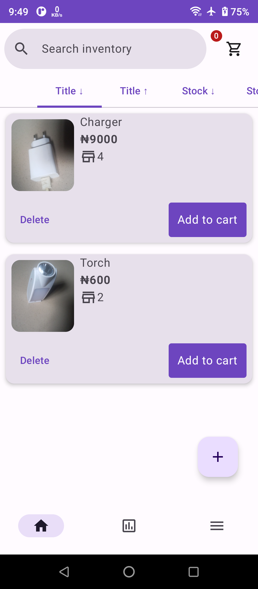
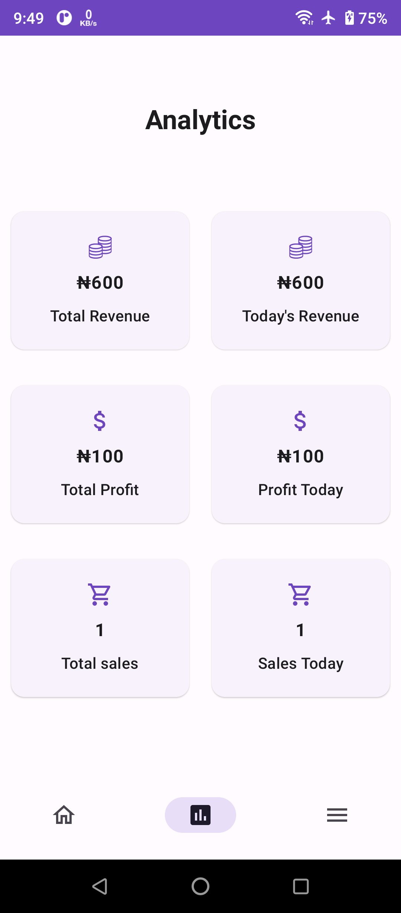
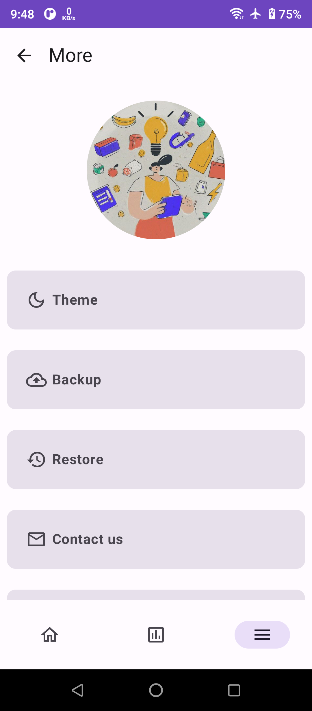

<div align="center">
</br>


</div>

<h1 align="center">Inventory Manager</h1>

</br>
<p align="center">
  </a>
  </a>
  </a> 
  </a>
  
<h4 align="center">Inventory Manager is made for businesses to manage and track their stock as well as their revenue

<br>
<br>
<div align="center">




  
# ⬇️ Download
<a href="https://github.com/micokpori/Inventory-Manager/releases">
</div>

# Features ✨

_Inventory Manager_ focuses on the following key things:

- Backup / Restore functionality
- Login / Sign Up flow
- Add pictures for each inventory items
- Revenue monitoring
- Clean UI/UX
- Offline
- System default/Light/Dark mode

# Built with 🛠

- [Kotlin](https://kotlinlang.org/) - First class and official programming language for Android development.
- [Firebase](https://firebase.google.com) - Firebase is an app development platform that helps you build and grow apps and games users love. Backed by Google and trusted by millions of businesses around the world.
- [Jetpack Compose UI Toolkit](https://developer.android.com/jetpack/compose) - Modern UI development toolkit.
- [Android Architecture Components](https://developer.android.com/-topic/libraries/architecture) - Collection of libraries that help you design robust, testable, and maintainable apps.
  - [Room](https://developer.android.com/topic/libraries/architecture/room) - Room is an Android library which is an ORM that wraps Android's native SQLite database.
  - [StateFlow and SharedFlow](https://developer.android.com/kotlin/flow/stateflow-and-sharedflow#:~:text=StateFlow%20is%20a%20state%2Dholder,property%20of%20the%20MutableStateFlow%20class.) - StateFlow and SharedFlow are Flow APIs that enable flows to optimally emit state updates and emit values to multiple consumers.
- [Dependency Injection](https://developer.android.com/training/dependency-injection) -
    - [Hilt-Dagger](https://dagger.dev/hilt/) - A standard way to incorporate Dagger dependency injection into an Android application.
    - [Hilt-ViewModel](https://developer.android.com/training/dependency-injection/hilt-jetpack) - DI for injecting ```ViewModel```. 
- [Accompanist](https://google.github.io/accompanist/) - A collection of extension libraries for Jetpack Compose.
- [Serialization](https://github.com/Kotlin/kotlinx.serialization) - Kotlin Serialization is a cross-platform and multi-format framework for data serialization—converting trees of objects to strings, byte arrays, or other serial representations and back. Kotlin Serialization fully supports and enforces the Kotlin type system, making sure only valid objects can be deserialized.
# Architecture 👷‍♂️
This app uses [MVVM(Model View View-Model)](https://developer.android.com/topic/architecture#recommended-app-arch) architecture.
